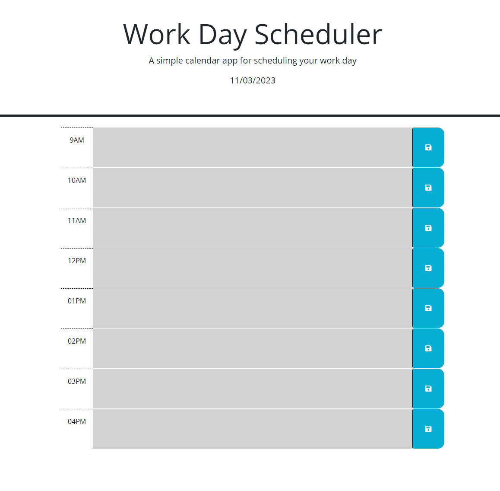

# scheduler-bc

## Description

This is a tool for making a 9 to 5 work schedule. With this app you'll be able to save text to local storage.

## Installation

N/A

## Usage

Click on the hour you wish to type and press the blue save button when you are done. Once you press save whatever you wrote will be saved to local storage so even if you refresh the page your text will be there.

## Credits

N/A

## License

Please refer to the LICENSE in the repo.